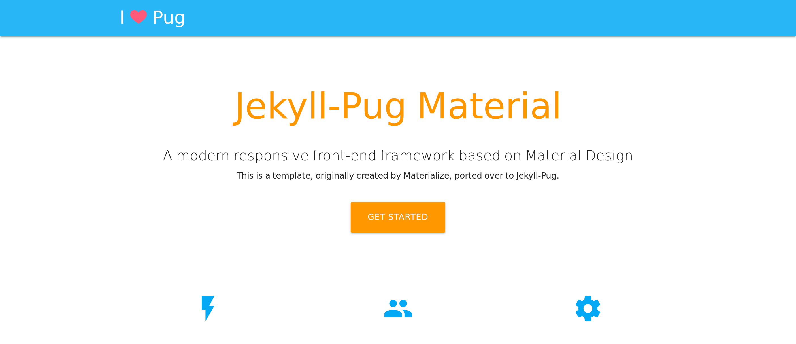

Jekyll-Pug-Material
---

# A Material Design Pug Experience Using [Jekyll-Pug](https://jekyll-pug.dougie.io/)

## To Run:

1. Clone/download this repository.
2. `cd` into the cloned/downloaded repository and run the command `bundle`.
3. Run the command `jekyll serve`.

## Package.json?

The package.json is for deploying to Netlify. It tells Netlify to install the Pug-CLI NPM package which is needed in order to run Jekyll-Pug.
